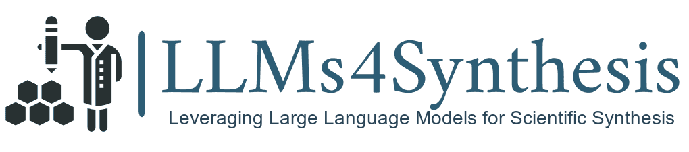
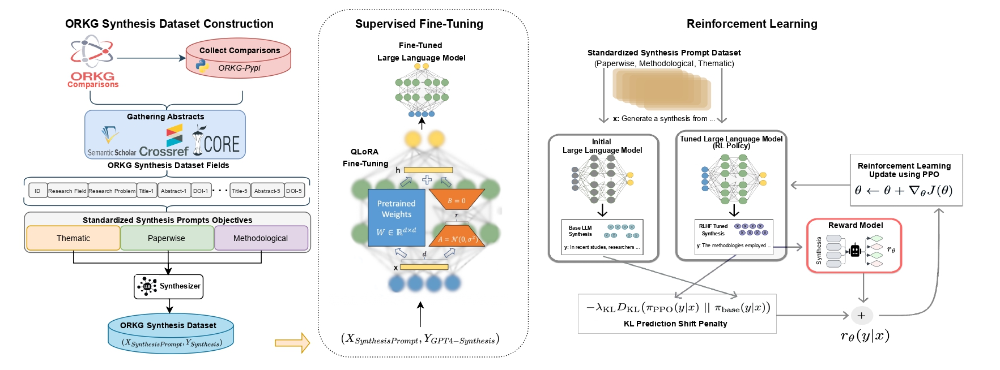

<div align="center">
 
</div>


<div align="center">

 
[](https://github.com/pre-commit/pre-commit)
[](https://github.com/psf/black)
[](https://pycqa.github.io/isort/)
[](https://opensource.org/licenses/MIT)

</div>

<div style="color:red;">This work is accepted for publication at JCDL-2024 conference.</div>

### What is the LLMs4Synthesis?

In response to the growing complexity and volume of scientific literature, this work introduces the LLMs4Synthesis framework, designed to enhance the capabilities of Large Language Models (LLMs) in generating high-quality scientific syntheses. The following diagram represents the LLMs4Synthesis framework.

<div align="center">
 
</div>

This framework addresses the need for rapid, coherent, and contextually rich integration of scientific insights, leveraging both open-source and proprietary LLMs. It also examines the effectiveness of LLMs in evaluating the integrity and reliability of these syntheses, alleviating inadequacies in current quantitative metrics. Our study contributes to this field by developing a novel methodology for processing scientific papers, defining new synthesis types, and establishing nine detailed quality criteria for evaluating syntheses. The integration of LLMs with reinforcement learning and AI feedback is proposed to optimize synthesis quality, ensuring alignment with established criteria. The LLMs4Synthesis framework and its components are made available, promising to enhance both the generation and evaluation processes in scientific research synthesis.


### ORKG synthesis dataset
The **ORKG Synthesis Dataset** is available at  [https://github.com/jd-coderepos/scisynthesis](https://github.com/jd-coderepos/scisynthesis)

### Installation
You can also install and use the LLMs4Synthesis using the following commands.
```cmd
git clone https://github.com/HamedBabaei/LLMs4Synthesis.git
cd LLMs4Synthesis

pip install -r requirements.txt
mv .env-example .env
```
Next, update your tokens in .env or if you don't want to use OpenAI LLMs just put dummy tokens there. Once you installed the requirements and prepared the .env file, you can move forward with experimentation.

### How to run?
To run the models run the following command lines:

```cmd
# SFT
python3.9 llm_finetuning.py

# RL (w/ Basic Features)
python3.9 rlhf_style_training.py

# SFT + RL (w/ Basic Features)
python3.9 rlhf_style_warmup_training.py

# RLAIF (w/ GPT-4 Features)
python3.9 rlhf_style_gpt4_training.py

# SFT + RLAIF (w/ GPT-4 Features)
python3.9 rlhf_style_gpt4_warmup_training.py

# Inference on all models (including Vanilla GPT-4, Vannila Mistral-7B)
python3.9 inference.py

# Evaluation on all models
python3.9 evaluation.py
```
### Example Synthesis

The `abstracts` are not provided here, but they are present in the prompt template. The prompt template is available at: `templates/standardized_synthesis_generation.txt`.  Prompt Template Research Problem and paper titles are:
* **Research Problem**: `UV Visible spectroscopy in highly charged ions (HCI)`
* **Paper 1 (title)**: `Visible spectrum of highly charged ions: The forbidden optical lines of Kr, Xe, and Ba ions in  the Ar I to Kr I isoelectronic sequence`
* **Paper 2 (title)**: `Lifetime measurements in the ground configuration of and using an electron beam ion trap`
* **Paper 3 (title)**: `3. UV light from the ground term of Ti-like ytterbium, tungsten, and bismuth`
* **Paper 4 (title)**: `The visible spectrum of highly charged ions: A window to fundamental physics`
* **Paper 5 (title)**: `First results from the Freiburg Electron Beam Ion Trap FreEBIT`
* **Objective**: `methodological`

With the `methodological` objective the synthesis form `SFT + RLAIF (w/ GPT-4 Features)` Model is (the Word Count of this synthesis is `198`):

```In the exploration of UV Visible spectroscopy in highly charged ions (HCI), various methodologies have been employed to probe the forbidden optical lines and transitions within these ions. The use of electron beam ion traps (EBITs) is a common technique across studies, providing a controlled environment for the excitation and observation of HCIs. The Lawrence Livermore National Laboratory EBIT was instrumental in identifying visible transitions in Kr, Xe, and Ba ions, with ionization stages determined by sweeping the electron beam energy (1). Similarly, the Freiburg EBIT, FreEBIT, was used to observe highly charged ions of Xe, Ba, W, Kr, and Ar, with charge states up to 63+, and measured forbidden transitions in the visible range (5). The precision of these EBITs is evident in the high-resolution optical imaging spectrograph, which achieved a resolution of γ/δγ ≈ 4000 in the optical range (5). Complementary to EBITs, atomic structure calculations have been employed to propose possible identifications for unidentified lines within the ground-state configuration and the first excited configuration of HCIs (1). Radiative lifetime measurements have also been conducted by monitoring the temporal behavior of radiative decays during magnetic trapping mode in an EBIT, providing insights into the temporal dynamics of HCI radiative decays (2). ```

### Citation
```
```

